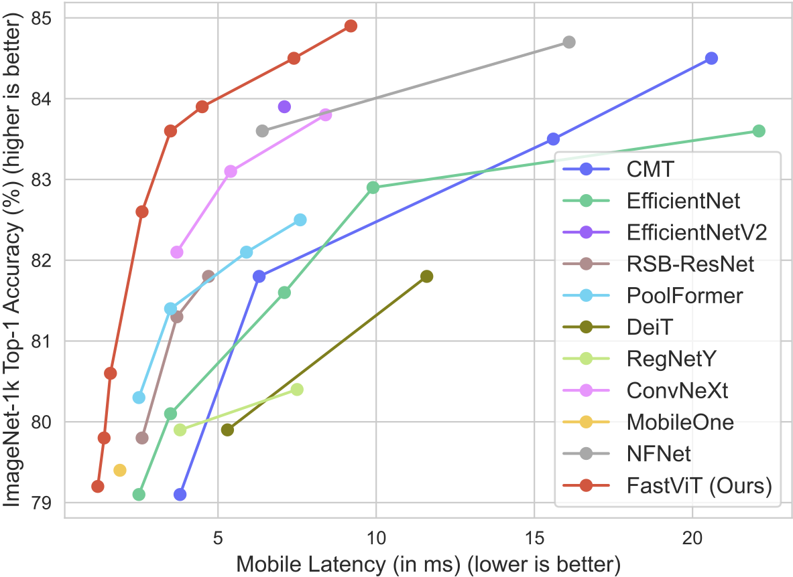

# FastViT:  A Fast Hybrid Vision Transformer using Structural Reparameterization

This is the official repository of 

**FastViT:  A Fast Hybrid Vision Transformer using Structural Reparameterization.** 
*Pavan Kumar Anasosalu Vasu, James Gabriel, Jeff Zhu, Oncel Tuzel, Anurag Ranjan.* ICCV 2023

[](https://arxiv.org/abs/2303.14189)
[](https://machinelearning.apple.com/research/)



All models are trained on ImageNet-1K and benchmarked on iPhone 12 Pro using [ModelBench app](https://github.com/apple/ml-mobileone/tree/main/ModelBench).


## Setup
```bash
conda create -n fastvit python=3.9
conda activate fastvit
conda install pytorch==1.11.0 torchvision==0.12.0 torchaudio==0.11.0 cudatoolkit=11.3 -c pytorch
pip install -r requirements.txt
```

## Usage
To use our model, follow the code snippet below,

```python
import torch
import models
from timm.models import create_model
from models.modules.mobileone import reparameterize_model

# To Train from scratch/fine-tuning
model = create_model("fastvit_t8")
# ... train ...

# Load unfused pre-trained checkpoint for fine-tuning
# or for downstream task training like detection/segmentation
checkpoint = torch.load('/path/to/unfused_checkpoint.pth.tar')
model.load_state_dict(checkpoint['state_dict'])
# ... train ...

# For inference
model.eval()      
model_inf = reparameterize_model(model)
# Use model_inf at test-time
```

## FastViT Model Zoo
### Image Classification

Models trained on ImageNet-1K

| Model        | Top-1 Acc. |           Latency           | Pytorch Checkpoint (url) |       CoreML Model       |
|:-------------|:----------:|:----------------------------:|:------------------------:|:------------------------:|
| FastViT-T8   |    76.2    |  [0.8](docs/latency/t8.PNG)  |   [T8](https://docs-assets.developer.apple.com/ml-research/models/fastvit/image_classification_models/fastvit_t8_reparam.pth.tar)([unfused](https://docs-assets.developer.apple.com/ml-research/models/fastvit/image_classification_models/fastvit_t8.pth.tar))    |  [fastvit_t8.mlpackage.zip](https://docs-assets.developer.apple.com/ml-research/models/fastvit/coreml_models/fastvit_t8_reparam.pth.mlpackage.zip)  |
| FastViT-T12  |    79.3    | [1.2](docs/latency/t12.PNG)  |   [T12](https://docs-assets.developer.apple.com/ml-research/models/fastvit/image_classification_models/fastvit_t12_reparam.pth.tar)([unfused](https://docs-assets.developer.apple.com/ml-research/models/fastvit/image_classification_models/fastvit_t12.pth.tar))   | [fastvit_t12.mlpackage.zip](https://docs-assets.developer.apple.com/ml-research/models/fastvit/coreml_models/fastvit_t12_reparam.pth.mlpackage.zip)  |
| FastViT-S12  |    79.9    | [1.4](docs/latency/s12.PNG)  |   [S12](https://docs-assets.developer.apple.com/ml-research/models/fastvit/image_classification_models/fastvit_s12_reparam.pth.tar)([unfused](https://docs-assets.developer.apple.com/ml-research/models/fastvit/image_classification_models/fastvit_s12.pth.tar))   | [fastvit_s12.mlpackage.zip](https://docs-assets.developer.apple.com/ml-research/models/fastvit/coreml_models/fastvit_s12_reparam.pth.mlpackage.zip)  |
| FastViT-SA12 |    80.9    | [1.6](docs/latency/sa12.PNG) |  [SA12](https://docs-assets.developer.apple.com/ml-research/models/fastvit/image_classification_models/fastvit_sa12_reparam.pth.tar)([unfused](https://docs-assets.developer.apple.com/ml-research/models/fastvit/image_classification_models/fastvit_sa12.pth.tar))   | [fastvit_sa12.mlpackage.zip](https://docs-assets.developer.apple.com/ml-research/models/fastvit/coreml_models/fastvit_sa12_reparam.pth.mlpackage.zip) |
| FastViT-SA24 |    82.7    | [2.6](docs/latency/sa24.PNG) |  [SA24](https://docs-assets.developer.apple.com/ml-research/models/fastvit/image_classification_models/fastvit_sa24_reparam.pth.tar)([unfused](https://docs-assets.developer.apple.com/ml-research/models/fastvit/image_classification_models/fastvit_sa24.pth.tar))   | [fastvit_sa24.mlpackage.zip](https://docs-assets.developer.apple.com/ml-research/models/fastvit/coreml_models/fastvit_sa24_reparam.pth.mlpackage.zip) |
| FastViT-SA36 |    83.6    | [3.5](docs/latency/sa36.PNG) |  [SA36](https://docs-assets.developer.apple.com/ml-research/models/fastvit/image_classification_models/fastvit_sa36_reparam.pth.tar)([unfused](https://docs-assets.developer.apple.com/ml-research/models/fastvit/image_classification_models/fastvit_sa36.pth.tar))   | [fastvit_sa36.mlpackage.zip](https://docs-assets.developer.apple.com/ml-research/models/fastvit/coreml_models/fastvit_sa36_reparam.pth.mlpackage.zip) |
| FastViT-MA36 |    83.9    | [4.6](docs/latency/ma36.PNG) |  [MA36](https://docs-assets.developer.apple.com/ml-research/models/fastvit/image_classification_models/fastvit_ma36_reparam.pth.tar)([unfused](https://docs-assets.developer.apple.com/ml-research/models/fastvit/image_classification_models/fastvit_ma36.pth.tar))   | [fastvit_ma36.mlpackage.zip](https://docs-assets.developer.apple.com/ml-research/models/fastvit/coreml_models/fastvit_ma36_reparam.pth.mlpackage.zip) |


Models trained on ImageNet-1K with knowledge distillation.

| Model        | Top-1 Acc. |           Latency           | Pytorch Checkpoint (url) |                                                                           CoreML Model                                                                            |
|:-------------|:----------:|:----------------------------:|:------------------------:|:-----------------------------------------------------------------------------------------------------------------------------------------------------------------:|
| FastViT-T8   |    77.2    |  [0.8](docs/latency/t8.PNG)  |   [T8](https://docs-assets.developer.apple.com/ml-research/models/fastvit/image_classification_distilled_models/fastvit_t8_reparam.pth.tar)([unfused](https://docs-assets.developer.apple.com/ml-research/models/fastvit/image_classification_distilled_models/fastvit_t8.pth.tar))    |    [fastvit_t8.mlpackage.zip](https://docs-assets.developer.apple.com/ml-research/models/fastvit/coreml_distilled_models/fastvit_t8_reparam.pth.mlpackage.zip)    |
| FastViT-T12  |    80.3    | [1.2](docs/latency/t12.PNG)  |   [T12](https://docs-assets.developer.apple.com/ml-research/models/fastvit/image_classification_distilled_models/fastvit_t12_reparam.pth.tar)([unfused](https://docs-assets.developer.apple.com/ml-research/models/fastvit/image_classification_distilled_models/fastvit_t12.pth.tar))   |   [fastvit_t12.mlpackage.zip](https://docs-assets.developer.apple.com/ml-research/models/fastvit/coreml_distilled_models/fastvit_t12_reparam.pth.mlpackage.zip)   |
| FastViT-S12  |    81.1    | [1.4](docs/latency/s12.PNG)  |   [S12](https://docs-assets.developer.apple.com/ml-research/models/fastvit/image_classification_distilled_models/fastvit_s12_reparam.pth.tar)([unfused](https://docs-assets.developer.apple.com/ml-research/models/fastvit/image_classification_distilled_models/fastvit_s12.pth.tar))   |      [fastvit_s12.mlpackage.zip](https://docs-assets.developer.apple.com/ml-research/models/fastvit/coreml_distilled_models/fastvit_s12_reparam.pth.mlpackage.zip)      |
| FastViT-SA12 |    81.9    | [1.6](docs/latency/sa12.PNG) |  [SA12](https://docs-assets.developer.apple.com/ml-research/models/fastvit/image_classification_distilled_models/fastvit_sa12_reparam.pth.tar)([unfused](https://docs-assets.developer.apple.com/ml-research/models/fastvit/image_classification_distilled_models/fastvit_sa12.pth.tar))   |     [fastvit_sa12.mlpackage.zip](https://docs-assets.developer.apple.com/ml-research/models/fastvit/coreml_distilled_models/fastvit_sa12_reparam.pth.mlpackage.zip)     |
| FastViT-SA24 |    83.4    | [2.6](docs/latency/sa24.PNG) |  [SA24](https://docs-assets.developer.apple.com/ml-research/models/fastvit/image_classification_distilled_models/fastvit_sa24_reparam.pth.tar)([unfused](https://docs-assets.developer.apple.com/ml-research/models/fastvit/image_classification_distilled_models/fastvit_sa24.pth.tar))   |     [fastvit_sa24.mlpackage.zip](https://docs-assets.developer.apple.com/ml-research/models/fastvit/coreml_distilled_models/fastvit_sa24_reparam.pth.mlpackage.zip)     |
| FastViT-SA36 |    84.2    | [3.5](docs/latency/sa36.PNG) |  [SA36](https://docs-assets.developer.apple.com/ml-research/models/fastvit/image_classification_distilled_models/fastvit_sa36_reparam.pth.tar)([unfused](https://docs-assets.developer.apple.com/ml-research/models/fastvit/image_classification_distilled_models/fastvit_sa36.pth.tar))   |     [fastvit_sa36.mlpackage.zip](https://docs-assets.developer.apple.com/ml-research/models/fastvit/coreml_distilled_models/fastvit_sa36_reparam.pth.mlpackage.zip)     |
| FastViT-MA36 |    84.6    | [4.6](docs/latency/ma36.PNG) |  [MA36](https://docs-assets.developer.apple.com/ml-research/models/fastvit/image_classification_distilled_models/fastvit_ma36_reparam.pth.tar)([unfused](https://docs-assets.developer.apple.com/ml-research/models/fastvit/image_classification_distilled_models/fastvit_ma36.pth.tar))   |     [fastvit_ma36.mlpackage.zip](https://docs-assets.developer.apple.com/ml-research/models/fastvit/coreml_distilled_models/fastvit_ma36_reparam.pth.mlpackage.zip)     |

#### Latency Benchmarking
Latency of all models measured on iPhone 12 Pro using [ModelBench app](https://github.com/apple/ml-mobileone/tree/main/ModelBench). 
For further details please contact [James Gabriel](mailto:james_gabriel@apple.com) and [Jeff Zhu](mailto:jeff.zhu@apple.com).
All reported numbers are rounded to the nearest decimal.

## Training
### Image Classification
#### Dataset Preparation

Download the [ImageNet-1K](http://image-net.org/) dataset and structure the data as follows:
```
/path/to/imagenet-1k/
  train/
    class1/
      img1.jpeg
    class2/
      img2.jpeg
  validation/
    class1/
      img3.jpeg
    class2/
      img4.jpeg
```

To train a variant of FastViT model, follow the respective command below:
<details>
<summary>
FastViT-T8
</summary>

```
# Without Distillation
python -m torch.distributed.launch --nproc_per_node=8 train.py \
/path/to/ImageNet/dataset --model fastvit_t8 -b 128 --lr 1e-3 \
--native-amp --mixup 0.2 --output /path/to/save/results \
--input-size 3 256 256

# With Distillation
python -m torch.distributed.launch --nproc_per_node=8 train.py \
/path/to/ImageNet/dataset --model fastvit_t8 -b 128 --lr 1e-3 \ 
--native-amp --mixup 0.2 --output /path/to/save/results \
--input-size 3 256 256 
--distillation-type "hard"
```
</details>


<details>
<summary>
FastViT-T12
</summary>

```
# Without Distillation
python -m torch.distributed.launch --nproc_per_node=8 train.py \
/path/to/ImageNet/dataset --model fastvit_t12 -b 128 --lr 1e-3 \
--native-amp --mixup 0.2 --output /path/to/save/results \
--input-size 3 256 256

# With Distillation
python -m torch.distributed.launch --nproc_per_node=8 train.py \
/path/to/ImageNet/dataset --model fastvit_t12 -b 128 --lr 1e-3 \ 
--native-amp --mixup 0.2 --output /path/to/save/results \
--input-size 3 256 256 
--distillation-type "hard"
```
</details>


<details>
<summary>
FastViT-S12
</summary>

```
# Without Distillation
python -m torch.distributed.launch --nproc_per_node=8 train.py \
/path/to/ImageNet/dataset --model fastvit_s12 -b 128 --lr 1e-3 \
--native-amp --mixup 0.2 --output /path/to/save/results \
--input-size 3 256 256

# With Distillation
python -m torch.distributed.launch --nproc_per_node=8 train.py \
/path/to/ImageNet/dataset --model fastvit_s12 -b 128 --lr 1e-3 \ 
--native-amp --mixup 0.2 --output /path/to/save/results \
--input-size 3 256 256 
--distillation-type "hard"
```
</details>


<details>
<summary>
FastViT-SA12
</summary>

```
# Without Distillation
python -m torch.distributed.launch --nproc_per_node=8 train.py \
/path/to/ImageNet/dataset --model fastvit_sa12 -b 128 --lr 1e-3 \
--native-amp --mixup 0.2 --output /path/to/save/results \
--input-size 3 256 256 --drop-path 0.1

# With Distillation
python -m torch.distributed.launch --nproc_per_node=8 train.py \
/path/to/ImageNet/dataset --model fastvit_sa12 -b 128 --lr 1e-3 \ 
--native-amp --output /path/to/save/results \
--input-size 3 256 256 
--distillation-type "hard"
```
</details>


<details>
<summary>
FastViT-SA24
</summary>

```
# Without Distillation
python -m torch.distributed.launch --nproc_per_node=8 train.py \
/path/to/ImageNet/dataset --model fastvit_sa24 -b 128 --lr 1e-3 \
--native-amp --mixup 0.2 --output /path/to/save/results \
--input-size 3 256 256 --drop-path 0.1

# With Distillation
python -m torch.distributed.launch --nproc_per_node=8 train.py \
/path/to/ImageNet/dataset --model fastvit_sa24 -b 128 --lr 1e-3 \ 
--native-amp --output /path/to/save/results \
--input-size 3 256 256 --drop-path 0.05 \
--distillation-type "hard"
```
</details>

<details>
<summary>
FastViT-SA36
</summary>

```
# Without Distillation
python -m torch.distributed.launch --nproc_per_node=8 train.py \
/path/to/ImageNet/dataset --model fastvit_sa36 -b 128 --lr 1e-3 \
--native-amp --mixup 0.2 --output /path/to/save/results \
--input-size 3 256 256 --drop-path 0.2

# With Distillation
python -m torch.distributed.launch --nproc_per_node=8 train.py \
/path/to/ImageNet/dataset --model fastvit_sa36 -b 128 --lr 1e-3 \ 
--native-amp --output /path/to/save/results \
--input-size 3 256 256 --drop-path 0.1 \
--distillation-type "hard"
```
</details>


<details>
<summary>
FastViT-MA36
</summary>

```
# Without Distillation
python -m torch.distributed.launch --nproc_per_node=8 train.py \
/path/to/ImageNet/dataset --model fastvit_t8 -b 128 --lr 1e-3 \
--native-amp --output /path/to/save/results \
--input-size 3 256 256 --drop-path 0.35

# With Distillation
python -m torch.distributed.launch --nproc_per_node=8 train.py \
/path/to/ImageNet/dataset --model fastvit_t8 -b 128 --lr 1e-3 \ 
--native-amp --output /path/to/save/results \
--input-size 3 256 256 --drop-path 0.2 \
--distillation-type "hard"
```
</details>

## Evaluation
To run evaluation on ImageNet, follow the example command below:
<details>
<summary>
FastViT-T8
</summary>

```
# Evaluate unfused checkpoint
python validate.py /path/to/ImageNet/dataset --model fastvit_t8 \
--checkpoint /path/to/pretrained_checkpoints/fastvit_t8.pth.tar

# Evaluate fused checkpoint
python validate.py /path/to/ImageNet/dataset --model fastvit_t8 \
--checkpoint /path/to/pretrained_checkpoints/fastvit_t8_reparam.pth.tar \
--use-inference-mode
```
</details>

## Model Export
To export a coreml package file from a pytorch checkpoint, follow the example command below:
<details>
<summary>
FastViT-T8
</summary>

```
python export_model.py --variant fastvit_t8 --output-dir /path/to/save/exported_model \
--checkpoint /path/to/pretrained_checkpoints/fastvit_t8_reparam.pth.tar
```
</details>

## Citation

```
@inproceedings{vasufastvit2023,
  author = {Pavan Kumar Anasosalu Vasu and James Gabriel and Jeff Zhu and Oncel Tuzel and Anurag Ranjan},
  title = {FastViT:  A Fast Hybrid Vision Transformer using Structural Reparameterization},
  booktitle={Proceedings of the IEEE/CVF International Conference on Computer Vision},
  year = {2023}
}
```

## Acknowledgements
Our codebase is built using multiple opensource contributions, please see [ACKNOWLEDGEMENTS](ACKNOWLEDGEMENTS) for more details. 
